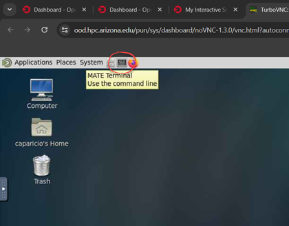
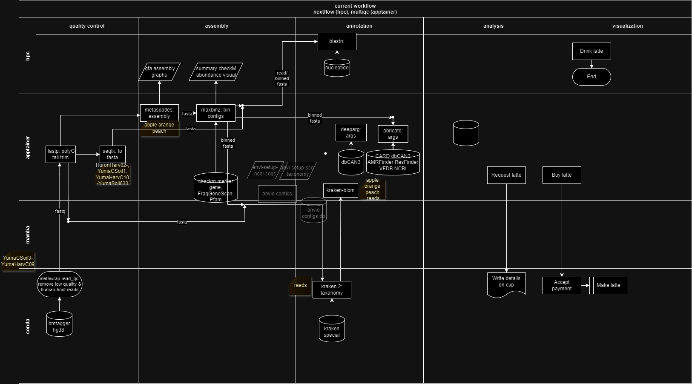

# 26 April 2024

## Tree Fruit Kraken 2 Scripts
<a href="https://hpcdocs.static.arizona.edu/running_jobs/batch_jobs/submitting_jobs" target="_blank">Submitting Batch Jobs</a>

- Open the slurm script directory in the terminal.

- Submit the script using the `sbatch` command:
```bash
sbatch kr_orange_reads.slurm
```
### kr_apple_reads.slurm
``` slurm
#!/bin/bash
#SBATCH --job-name=kr_apple_reads
#SBATCH --account=kcooper
#SBATCH --partition=standard
#SBATCH --nodes=1
#SBATCH --ntasks=64
#SBATCH --time=48:00:00
#SBATCH --mem-per-cpu=12gb                   
#SBATCH --mail-type=ALL

module load anaconda/2020
source ~/.bashrc
conda activate kraken2-env
cd /xdisk/kcooper/caparicio/tree-fruit

for file in 01c_fastp_reads/*_1.trimmed.fastq
do
    # Extract the base name of the file (without _1.trimmed.fastq)
    base=$(basename $file _1.trimmed.fastq)

    # Process only files with "apples" in the base name
    if [[ $base != *"apples"* ]]; then
        continue
    fi

    # Define input files
    file1="01c_fastp_reads/${base}_1.trimmed.fastq"
    file2="01c_fastp_reads/${base}_2.trimmed.fastq"

    # Define output files and temporary files
    output="04a_reads_kraken2/${base}_output.txt"
    temp_output="04a_reads_kraken2/${base}_output.tmp"
    report="04a_reads_kraken2/${base}_report.txt"
    temp_report="04a_reads_kraken2/${base}_report.tmp"

    # Check if output files from previous run exist and are incomplete, then remove them
    if [ -f "$output" ] || [ -f "$report" ]; then
        echo "Incomplete or previous output files found for $base. Removing..."
        rm -f "$output" "$report"
    fi

    # Run Kraken2 with temporary output files
    kraken2 --db /xdisk/kcooper/kcooper/database/Kraken_Special_DB \
            --confidence 0.1 \
            --report-minimizer-data \
            --output $temp_output \
            --paired \
            --report $temp_report \
            --memory-mapping \
            --use-names \
            $file1 \
            $file2

    # Check if Kraken2 ran successfully and rename temporary files
    if [ $? -eq 0 ]; then
        mv "$temp_output" "$output"
        mv "$temp_report" "$report"
    else
        echo "Kraken2 failed for $base. Temporary files not renamed."
    fi
done
```
### kr_orange_reads.slurm
``` slurm
#!/bin/bash
#SBATCH --job-name=kr_orange_reads
#SBATCH --account=kcooper
#SBATCH --partition=standard
#SBATCH --nodes=1
#SBATCH --ntasks=64
#SBATCH --time=24:00:00
#SBATCH --mem-per-cpu=20gb
#SBATCH --mail-type=ALL

module load anaconda/2020
source ~/.bashrc
conda activate kraken2-env

DB_PATH="/xdisk/kcooper/kcooper/database/Kraken_Special_DB"
cd /xdisk/kcooper/caparicio/tree-fruit
OUTPUT_DIR="04a_reads_kraken2"
INPUT_DIR="01c_fastp_reads"
THREADS=46
CONFIDENCE=0.1
REPORT_FILE="${OUTPUT_DIR}/kraken2_report.txt"
CHECKPOINT_FILE="${OUTPUT_DIR}/checkpoint.txt"

# Automated cleanup to ensure a clean slate before starting processing
echo "Cleaning up incomplete files..."
find ${OUTPUT_DIR} -name '*.tmp' -delete

# Loop through files, skipping those already processed
for file in ${INPUT_DIR}/*oranges*1.trimmed.fastq; do
    file_base=$(basename $file _1.trimmed.fastq)

    # Skip files processed in previous runs
    if [[ "$LAST_PROCESSED" > "$file_base" ]]; then
        continue
    fi

    paired_file="${INPUT_DIR}/${file_base}_2.trimmed.fastq"
    temp_output_file="${OUTPUT_DIR}/k2_${file_base}_output.txt.tmp"
    temp_report_file="${OUTPUT_DIR}/k2_${file_base}_report.txt.tmp"
    final_output_file="${OUTPUT_DIR}/k2_${file_base}_output.txt"
    final_report_file="${OUTPUT_DIR}/k2_${file_base}_report.txt"

    # Run Kraken2, directing output to temporary files, including minimizer data in the report
    kraken2 --db $DB_PATH \
            --paired $file $paired_file \
            --output $temp_output_file \
            --report $temp_report_file \
            --report-minimizer-data \
            --memory-mapping \
            --use-names \
            --threads $THREADS \
            --confidence $CONFIDENCE && {
        mv $temp_output_file $final_output_file
        mv $temp_report_file $final_report_file
        echo $file_base >> $CHECKPOINT_FILE
    } || {
        echo "Kraken 2 processing failed for $file_base. Cleaning up..."
        rm -f $temp_output_file $temp_report_file
    }
done

# Concatenate all individual reports into a comprehensive report
cat ${OUTPUT_DIR}/*_report.txt.tmp > $REPORT_FILE

# Cleanup checkpoint file and temporary reports after successful run
rm -f $CHECKPOINT_FILE
rm -f ${OUTPUT_DIR}/*_report.txt.tmp
```
### kr_peach_reads.slurm
``` slurm
#!/bin/bash
#SBATCH --job-name=kr_peach_reads
#SBATCH --account=kcooper
#SBATCH --partition=standard
#SBATCH --nodes=1
#SBATCH --ntasks=60
#SBATCH --time=24:00:00
#SBATCH --mem-per-cpu=20gb
#SBATCH --mail-type=ALL

module load anaconda/2020
source ~/.bashrc
conda activate kraken2-env

DB_PATH="/xdisk/kcooper/kcooper/database/Kraken_Special_DB"
cd /xdisk/kcooper/caparicio/tree-fruit
OUTPUT_DIR="04a_reads_kraken2"
INPUT_DIR="01c_fastp_reads"
THREADS=46
CONFIDENCE=0.1
REPORT_FILE="${OUTPUT_DIR}/kraken2_report.txt"
CHECKPOINT_FILE="${OUTPUT_DIR}/checkpoint.txt"

# Automated cleanup to ensure a clean slate before starting processing
echo "Cleaning up incomplete files..."
find ${OUTPUT_DIR} -name '*.tmp' -delete

# Loop through files, skipping those already processed
for file in ${INPUT_DIR}/*peaches*1.trimmed.fastq; do
    file_base=$(basename $file _1.trimmed.fastq)

    # Skip files processed in previous runs
    if [[ "$LAST_PROCESSED" > "$file_base" ]]; then
        continue
    fi

    paired_file="${INPUT_DIR}/${file_base}_2.trimmed.fastq"
    temp_output_file="${OUTPUT_DIR}/k2_${file_base}_output.txt.tmp"
    temp_report_file="${OUTPUT_DIR}/k2_${file_base}_report.txt.tmp"
    final_output_file="${OUTPUT_DIR}/k2_${file_base}_output.txt"
    final_report_file="${OUTPUT_DIR}/k2_${file_base}_report.txt"

    # Run Kraken2, directing output to temporary files, including minimizer data in the report
    kraken2 --db $DB_PATH \
            --paired $file $paired_file \
            --output $temp_output_file \
            --report $temp_report_file \
            --report-minimizer-data \
            --memory-mapping \
            --use-names \
            --threads $THREADS \
            --confidence $CONFIDENCE && {
        mv $temp_output_file $final_output_file
        mv $temp_report_file $final_report_file
        echo $file_base >> $CHECKPOINT_FILE
    } || {
        echo "Kraken 2 processing failed for $file_base. Cleaning up..."
        rm -f $temp_output_file $temp_report_file
    }
done

# Concatenate all individual reports into a comprehensive report
cat ${OUTPUT_DIR}/*_report.txt.tmp > $REPORT_FILE

# Cleanup checkpoint file and temporary reports after successful run
rm -f $CHECKPOINT_FILE
rm -f ${OUTPUT_DIR}/*_report.txt.tmp
```
***
## Using Mamba/Conda in Jupyter

<a href="https://uarizona.atlassian.net/wiki/spaces/UAHPC/pages/75989933/GUI+Jobs" target="_blank">HPC GUI Jobs</a>

Configuring a Jupyter Notebook to use an already-existing kraken 2 environment:
1. **Launch Interactive Desktop**
Run Time = 24 ; Core count on a single node = 60 ; Memory per core = 20



3. **Load Anaconda Module**  
In the interactive terminal, load the Anaconda module to access the `conda` command:
``` bash
module load anaconda/2020
```
3. **Activate the Kraken 2 Conda Environment**  
``` bash
conda activate kraken2-env
```
4. **Install IPython Kernel**  
Install the IPython kernel in `kraken2-env` to make it available in Jupyter
``` bash
conda install ipykernel
```
5. **Add the iPython Kernel to the  Kraken 2 Jupyter Environment**  
``` bash
python -m ipykernel install --user --name kraken2-env --display-name "Python (kraken2-env)"
```
6. **After adding the kernel, the interactive terminal session can be closed.**  

7. **Restart the Jupyter Session**  
Log out and start a new Jupyter session to refresh the kernel list.

9. **Select the New Kernel from the "New" Dropdown Menu**  
When starting a new notebook, select the "Python (kraken2-env)" kernel to use in the custom environment.

These steps ensure that the `kraken2-env` is available as a kernel in Jupyter notebooks, allowing the Python version management and Kraken 2 access.

Once an IPython kernel  has been created for `kraken2-env`, the new kernel becomes a permanent option in the Jupyter Notebook interface.
### How It Works
By running `ipykernel install --user --name kraken2-env --display-name "Python (kraken2-env)"`, a JSON file for this kernel is created in the Jupyter kernels directory (typically `.local/share/jupyter/kernels/kraken2-env/` on Unix-like systems). This JSON file contains the metadata necessary for Jupyter to identify and launch the kernel, including the path to the Python executable within the activated conda environment.
### Ensuring the Kernel Appears in Subsequent Sessions
- **Permanent User Option**: As long as the kernel's JSON configuration file remains in its directory and points to a valid Python executable within an accessible conda environment, it will appear as an option every time the Jupyter Notebook server starts from any location on the same system/user account.
- **Recalling the Kernel**: When creating a new notebook (or opening an existing one), select the “Python (kraken2-env)” kernel from the Kernel menu or the dropdown menu to start a notebook in that environment.
### If the Kernel Doesn't Appear
- **Environment Changes**: If the kernel doesn't appear, ensure the `kraken2-env` environment and its IPython kernel installation haven't been altered or deleted.
- **Jupyter Configuration**: Check the Jupyter configuration to ensure it's scanning the correct directories for kernel specifications. Running `jupyter kernelspec list` in the terminal will show you the paths to the kernels available.
***
## Execute Shell Commands in Jupyter
- <a href="https://github.com/clizarraga-UAD7/Workshops/wiki/The-Command-Line-Interface-Shell" target="_blank">Dr. Lizárraga's Command Line Interface Shell</a>
- <a href="https://jupyter-notebook.readthedocs.io/en/v6.4.8/notebook.html" target="_blank">The Jupyter Notebook</a>
- <a href="https://github.com/ua-datalab/Workshops/wiki/Jupyter-Notebooks" target="_blank">Data Lab's Jupyter Notebooks</a>
- <a href="https://www.youtube.com/watch?v=QrbwPK5OWqA" target="_blank">Data Lab's [2024 Spring] Data Science Essentials Series - Introduction to Jupyter Notebooks YouTube</a>
- <a href="https://jupyterbook.org/en/stable/start/overview.html" target="_blank">Install Jupyter Book</a> via <a href="https://foss.cyverse.org/04_documentation_communication" target="_blank">CyVerse Foundational Open Science Skills 2024
  Documentation & Communication</a>
- <a href="https://www.youtube.com/watch?v=aIr0bFifu-Y" target="_blank">HPC: Jupyter in Singularity YouTube</a>
- <a href="https://www.youtube.com/watch?v=RxXrV45Csks" target="_blank">AnacondaTFJupyter YouTube</a>
- <a href="https://www.youtube.com/watch?v=RQxZcNRVh3M" target="_blank">CyVerse Webinar: Writing and Sharing Computational Analyses in Jupyter Notebooks YouTube</a>

ERROR: Indicates an attempt to execute shell commands in a Python environment within a Jupyter notebook. Python requires specific formatting to understand bash/shell syntax for executing shell commands.
Two options to resolve issues in Jupyter notebook cell:
### Option 1: Use IPython Magic Command for Shell Execution
IPython, upon which Jupyter notebooks are based, provides magic commands that extend the normal Python syntax. For running shell commands, use the `!` prefix or the `%%bash` cell magic for multi-line shell scripts.
#### Applying `!` for Single Line Commands:
To execute single-line shell commands, start the command with `!`:
``` py
!echo "Cleaning up incomplete files..."
```
#### Using `%%bash` for Multi-line Scripts:
For multi-line scripts, use the `%%bash` magic at the beginning of the cell. This tells Jupyter that the entire cell contains bash commands:
``` bash
%%bash
# Define directories
OUTPUT_DIR="your/output/dir"

# Function to clean up incomplete or corrupted files
cleanup() {
    echo "Cleaning up incomplete files..."
    find ${OUTPUT_DIR} -name '*.tmp' -delete
}

# Automated cleanup at start to ensure a clean slate
cleanup
```
Note: Ensure that `OUTPUT_DIR` is set to the correct directory path where your output files are stored.
### Option 2: Use Python to Perform the Same Task
Alternatively, translate bash functions into Python to accomplish same, leveraging Python's `os` and `glob` modules for directory and file operations:
``` py
import os
import glob

# Define directories
OUTPUT_DIR = "your/output/dir"

def cleanup():
    print("Cleaning up incomplete files...")
    for tmp_file in glob.glob(os.path.join(OUTPUT_DIR, '*.tmp')):
        os.remove(tmp_file)

# Automated cleanup at start to ensure a clean slate
cleanup()
```
This Python version accomplishes as the bash script above, but in Jupyter notebook's native Python environment.
***
## Sample Tracker
<!--
document$.subscribe(function() {
  var tables = document.querySelectorAll("article table:not([class])")
  tables.forEach(function(table) {
    new Tablesort(table)
  })
})
-->
| sample(s)               | stage           | program             | status                   | queue time     | cluster | run time hrs:min | Job #          | ntaskts (CPU -t) | Mem                                                      | -m                                                       | file location                                            | script                                           | script location                                |
|-------------------------|-----------------|---------------------|--------------------------|----------------|---------|------------------|----------------|------------------|----------------------------------------------------------|----------------------------------------------------------|----------------------------------------------------------|--------------------------------------------------|------------------------------------------------|
| queue                   | 4/24/2024       | puma                | 24                       | 9673002-missed | 62      | 20               | 1240           | jupyter          |                                                          |                                                          |                                                          |                                                  |                                                |
| apples313               | alignment       | blast               | queue                    | 4/23/2024      | puma    | 24               | 9670368-missed | 62               | 20                                                       | 1240                                                     | /kcooper/caparicio/tree-fruit/07a_reads_blast            | apple_blast.ipynb                                | /kcooper/caparicio/tree-fruit/07batch          |
| tree fruit reads        | biom file       | kraken-biom         | queue                    | 4/23/2024      | puma    | 12               | 9666325-missed | 42               | 20                                                       | 840                                                      | /kcooper/caparicio/tree-fruit/05_kraken-biom             | interactive                                      | /kcooper/caparicio/tree-fruit/05batch          |
| apples313               | arg             | deeparg             | queue                    | 4/22/2024      | puma    | 24               | 9661323-missed | 62               | 20                                                       | 1240                                                     | /kcooper/caparicio/tree-fruit/09_deeparg                 | apple_deeparg.ipynb                              | /kcooper/caparicio/tree-fruit/09batch          |
| apples313               | arg             | deeparg             | in progress              | 1-22:16:37     | puma    | 24               | 9607499        | 62               | 20                                                       | 1240                                                     | /kcooper/caparicio/tree-fruit/09_deeparg                 | apple_deeparg.ipynb                              | /kcooper/caparicio/tree-fruit/09batch          |
| apples313               | arg             | deeparg             | in progress              | 1-22:16:37     | puma    | 24               | 9607499        | 62               | 20                                                       | 1240                                                     | /kcooper/caparicio/tree-fruit/09_deeparg                 | apple_deeparg.ipynb                              | /kcooper/caparicio/tree-fruit/09batch          |
| apples313               | alignment       | blast               | in progress              | 2-13:54:46     | puma    | 24               | 9544144        | 62               | 20                                                       | 1240                                                     | /kcooper/caparicio/tree-fruit/07a_reads_blast            | apple_blast.ipynb                                | /kcooper/caparicio/tree-fruit/07batch          |
| apples313               | alignment       | blast               | in progress              | 2-18:24:00     | puma    | 24               | 9532276        | 62               | 20                                                       | 1240                                                     | /kcooper/caparicio/tree-fruit/07a_reads_blast            | apple_blast.ipynb                                | /kcooper/caparicio/tree-fruit/07batch          |
| apples313               | alignment       | blast               | in progress              | 0:02:11        | puma    | 24               | 9514722        | 62               | 20                                                       | 1240                                                     | /kcooper/caparicio/tree-fruit/07a_reads_blast            | apple_blast.ipynb                                | /kcooper/caparicio/tree-fruit/07batch          |
| apple                   | assembly        | metaSPAdes (SPAdes) | queue                    | puma           | 48      | 9678741          | 64             | 25               | 1600                                                     | cd /xdisk/kcooper/caparicio/tree-fruit/02assembly        | sbatch apple_assembly.slurm                              | cd /xdisk/kcooper/caparicio/tree-fruit/02batch   |                                                |
| peach                   | assembly        | metaSPAdes (SPAdes) | queue                    | puma           | 48      | 9659598          | 62             | 20               | 1240                                                     | cd /xdisk/kcooper/caparicio/tree-fruit/02assembly        | sbatch peach_assembly.slurm                              | cd /xdisk/kcooper/caparicio/tree-fruit/02batch   |                                                |
| orange                  | assembly        | metaSPAdes (SPAdes) | queue                    | puma           | 48      | 9656556          | 62             | 20               | 1240                                                     | cd /xdisk/kcooper/caparicio/tree-fruit/02assembly        | sbatch orange_assembly.slurm                             | cd /xdisk/kcooper/caparicio/tree-fruit/02batch   |                                                |
| apple                   | assembly        | metaSPAdes (SPAdes) | in progress              | 1-09:33:21     | puma    | 48               | 9656539        | 62               | 20                                                       | 1240                                                     | cd /xdisk/kcooper/caparicio/tree-fruit/02assembly        | sbatch apple_assembly.slurm                      | cd /xdisk/kcooper/caparicio/tree-fruit/02batch |
| peach                   | assembly        | metaSPAdes (SPAdes) | in progress              | 1-13:59:27     | puma    | 48               | 9659598        | 62               | 20                                                       | 1240                                                     | cd /xdisk/kcooper/caparicio/tree-fruit/02assembly        | sbatch peach_assembly.slurm                      | cd /xdisk/kcooper/caparicio/tree-fruit/02batch |
| apple                   | assembly        | metaSPAdes (SPAdes) | in progress              | 1-01:53:22     | puma    | 48               | 9626829        | 62               | 20                                                       | 1240                                                     | cd /xdisk/kcooper/caparicio/tree-fruit/02assembly        | sbatch apple_assembly.slurm                      | cd /xdisk/kcooper/caparicio/tree-fruit/02batch |
| orange                  | assembly        | metaSPAdes (SPAdes) | in progress              | 1-20:23:44     | puma    | 48               | 9607486        | 62               | 20                                                       | 1240                                                     | cd /xdisk/kcooper/caparicio/tree-fruit/02assembly        | sbatch orange_assembly.slurm                     | cd /xdisk/kcooper/caparicio/tree-fruit/02batch |
| peach                   | assembly        | metaSPAdes (SPAdes) | in progress              | 2-07:44:37     | puma    | 0:00             | 9569668        | 62               | 20                                                       | 1240                                                     | cd /xdisk/kcooper/caparicio/tree-fruit/02assembly        | sbatch peach_assembly.slurm                      | cd /xdisk/kcooper/caparicio/tree-fruit/02batch |
| apple                   | assembly        | metaSPAdes (SPAdes) | in progress              | 2-01:55:18     | puma    | 48               | 9569667        | 62               | 20                                                       | 1240                                                     | cd /xdisk/kcooper/caparicio/tree-fruit/02assembly        | sbatch apple_assembly.slurm                      | cd /xdisk/kcooper/caparicio/tree-fruit/02batch |
| peach                   | assembly        | metaSPAdes (SPAdes) | in progress              | 8-12:40:52     | puma    | 48               | 9481898        | 64               | 20                                                       | 1280                                                     | cd /xdisk/kcooper/caparicio/tree-fruit/02assembly        | sbatch peach_assembly.slurm                      | cd /xdisk/kcooper/caparicio/tree-fruit/02batch |
| orange                  | assembly        | metaSPAdes (SPAdes) | in progress              | 1-22:23:40     | puma    | 48               | 9544142        | 62               | 20                                                       | 1240                                                     | cd /xdisk/kcooper/caparicio/tree-fruit/02assembly        | sbatch orange_assembly.slurm                     | cd /xdisk/kcooper/caparicio/tree-fruit/02batch |
| apple                   | assembly        | metaSPAdes (SPAdes) | in progress              | 5-01:30:51     | puma    | 48               | 9510852        | 60               | 20                                                       | 1200                                                     | cd /xdisk/kcooper/caparicio/tree-fruit/02assembly        | sbatch apple_assembly.slurm                      | cd /xdisk/kcooper/caparicio/tree-fruit/02batch |
| orange                  | assembly        | metaSPAdes (SPAdes) | in progress              | 8-07:36:36     | puma    | 48               | 9455659        | 64               | 20                                                       | 1280                                                     | cd /xdisk/kcooper/caparicio/tree-fruit/02assembly        | sbatch orange_assembly.slurm                     | cd /xdisk/kcooper/caparicio/tree-fruit/02batch |
| apple                   | assembly        | metaSPAdes (SPAdes) | in progress              | 9-19:56:59     | puma    | 0:00             | 9475436        | 64               | 20                                                       | 1280                                                     | cd /xdisk/kcooper/caparicio/tree-fruit/02assembly        | sbatch apple_assembly.slurm                      | cd /xdisk/kcooper/caparicio/tree-fruit/02batch |
| apple                   | assembly        | metaSPAdes (SPAdes) | in progress              | 9-10:02:53     | puma    | 48               | 9452625        | 64               | 20                                                       | 1280                                                     | cd /xdisk/kcooper/caparicio/tree-fruit/02assembly        | sbatch apple_assembly.slurm                      | cd /xdisk/kcooper/caparicio/tree-fruit/02batch |
| apple                   | assembly        | metaSPAdes (SPAdes) | in progress              | 9-20:30:02     | puma    | 48               | 9448076        | 62               | 20                                                       | 1240                                                     | cd /xdisk/kcooper/caparicio/tree-fruit/02assembly        | sbatch apple_assembly.slurm                      | cd /xdisk/kcooper/caparicio/tree-fruit/02batch |
| orange                  | taxonomic class | kraken 2            | complete                 | 9-06:30:40     | puma    | 24               | 9444742        | 64               | 20                                                       | 1280                                                     | cd /xdisk/kcooper/caparicio/tree-fruit/03a_reads_kraken2 | kr_orange_reads.ipynb                            | cd /xdisk/kcooper/caparicio/tree-fruit/03batch |
| peach                   | taxonomic class | kraken 2            | complete                 | 10-03:45:32    | puma    | 24               | 9444741        | 64               | 20                                                       | 1280                                                     | cd /xdisk/kcooper/caparicio/tree-fruit/03a_reads_kraken2 | sbatch kr_peach_reads.slurm                      | cd /xdisk/kcooper/caparicio/tree-fruit/03batch |
| orange                  | taxonomic class | kraken 2            | in progress              | puma           | 24      | 9431841          | 64             | 20               | 1280                                                     | cd /xdisk/kcooper/caparicio/tree-fruit/03a_reads_kraken2 | sbatch kr_orange_reads.slurm                             | cd /xdisk/kcooper/caparicio/tree-fruit/03batch   |                                                |
| apple                   | assembly        | metaSPAdes (SPAdes) | in progress              | puma           | 0:00    | 9448076          | 64             | 20               | 1280                                                     | cd /xdisk/kcooper/caparicio/tree-fruit/02assembly        | apple_read_assembly.ipynb                                | cd /xdisk/kcooper/caparicio/tree-fruit/02batch   |                                                |
| apple                   | assembly        | metaSPAdes (SPAdes) | REDOcompleteBUT NO FASTA | puma           | 48      | 9004247          | 64             | var              | var                                                      | cd /xdisk/kcooper/caparicio/tree-fruit/02assembly        | sbatch apples_assembly.slurm                             | cd /xdisk/kcooper/caparicio/tree-fruit/02batch   |                                                |
| YumaHarvC10-YumaSoil633 | poly-g removal  | fastp               | debug                    | puma           | 0:00    | 9398738          | 64             | 20               | 1280                                                     | cd /xdisk/kcooper/caparicio/MELONS/01c_fastp_reads2      | melon_fastp.ipynb melon_soil_fastp.ipynb                 | cd /xdisk/kcooper/caparicio/MELONS/              |                                                |
| orange                  | taxonomic class | kraken 2            | puma                     | 24             | 9245197 | 64               | 32             | 2048             | cd /xdisk/kcooper/caparicio/tree-fruit/03a_reads_kraken2 | sbatch kr_orange_reads.slurm                             | cd /xdisk/kcooper/caparicio/tree-fruit/03batch           |                                                  |                                                |
| peach                   | taxonomic class | kraken 2            | debug                    | puma           | 24      | 9245195          | 64             | 32               | 2048                                                     | cd /xdisk/kcooper/caparicio/tree-fruit/03a_reads_kraken2 | sbatch kr_peach_reads.slurm                              | cd /xdisk/kcooper/caparicio/tree-fruit/03batch   |                                                |
| melon                   | poly-g removal  | fastp               | debug                    | puma           | 24      | 9247470          | 48             | 4                | 192                                                      | cd /xdisk/kcooper/caparicio/MELONS/01c_fastp_reads       | sbatch melon_fastp.slurm                                 | cd /xdisk/kcooper/caparicio/MELONS/              |                                                |
| melon soil              | poly-g removal  | fastp               | in progress              | puma           | 24      | 9247471          | 48             | 4                | 192                                                      | cd /xdisk/kcooper/caparicio/tree-fruit/03a_reads_kraken2 | sbatch melon_soil_fastp.slurm                            | cd /xdisk/kcooper/caparicio/MELONS/              |                                                |
| tree-fruit              | poly-g removal  | fastp               | complete                 | puma           | 0:55    | 8662642          | 48             | 4                | 192                                                      | cd /xdisk/kcooper/caparicio/tree-fruit/01c_fastp_reads   | sbatch fruit_01c_fastp.slurm                             | cd /xdisk/kcooper/caparicio/tree-fruit           |                                                |
| melon/soil              | poly-g removal  | fastp               | debug                    | puma           | 528     | 9132669          | 48             | 4                | 192                                                      | cd /xdisk/kcooper/caparicio/MELONS/01c_fastp_reads       | sbatch melon_fastp.slurm                                 | cd /xdisk/kcooper/caparicio/MELONS               |                                                |
| apple                   | assembly        | metaSPAdes (SPAdes) | REDOcompleteBUT NO FASTA | puma           | 48      | 9004247          | 64             | var              | var                                                      | cd /xdisk/kcooper/caparicio/tree-fruit/02assembly        | sbatch apples_assembly.slurm                             | cd /xdisk/kcooper/caparicio/tree-fruit/02batch   |                                                |
| peach                   | assembly        | metaSPAdes (SPAdes) | killed                   | ocelote        | 972     | 2757752          | 28             | var              | var                                                      | cd /xdisk/kcooper/caparicio/tree-fruit/02assembly        | sbatch peach_assem.slurm                                 | cd /xdisk/kcooper/caparicio/tree-fruit/02batch   |                                                |
| orange                  | assembly        | metaSPAdes (SPAdes) | killed                   | elgato         | 144     | 1777319          | 16             | var              | var                                                      | cd /xdisk/kcooper/caparicio/tree-fruit/02assembly        | sbatch oranges_assembly.slurm                            | cd /xdisk/kcooper/caparicio/tree-fruit/02batch   |                                                |
| orange                  | assembly        | metaSPAdes (SPAdes) | killed                   | elgato         | 144     | 1777319          | 16             | var              | var                                                      | cd /xdisk/kcooper/caparicio/tree-fruit/02assembly        | sbatch oranges_assembly.slurm                            | cd /xdisk/kcooper/caparicio/tree-fruit/02batch   |                                                |
| apple                   | taxonomic class | kraken 2            | complete                 | puma           | 48      | 9016680          | 64             | 12               | 768                                                      | cd /xdisk/kcooper/caparicio/tree-fruit/03a_reads_kraken2 | sbatch kr_apple_reads.slurm                              | cd /xdisk/kcooper/caparicio/tree-fruit/03batch   |                                                |
| tree fruit              | fastq to fasta  | seqtk               | complete                 | elgato         | 0:35    | 1803380          | 8              | 4                | 32                                                       | cd /xdisk/kcooper/caparicio/tree-fruit/01d_fasta         | sbatch tree-fruit_fasta.slurm                            | cd /xdisk/kcooper/caparicio/tree-fruit/01d_fasta |                                                |

## Bioinformatics Workflow
